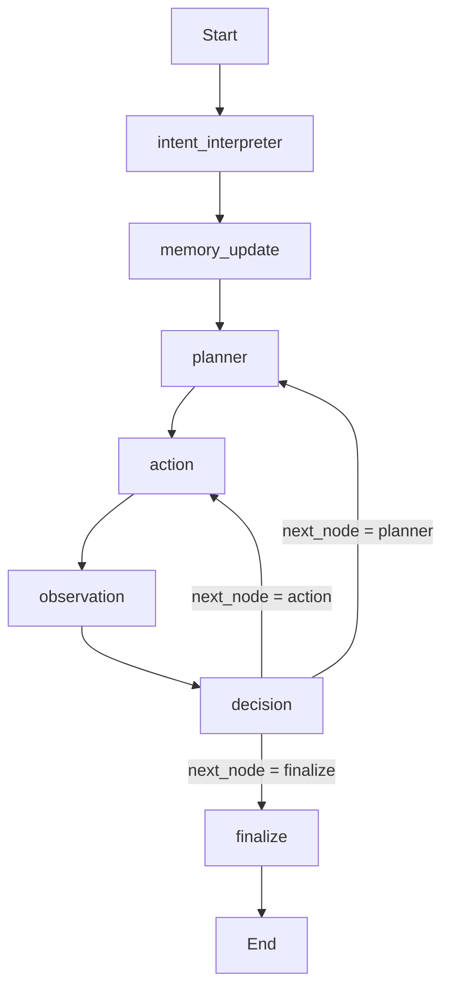
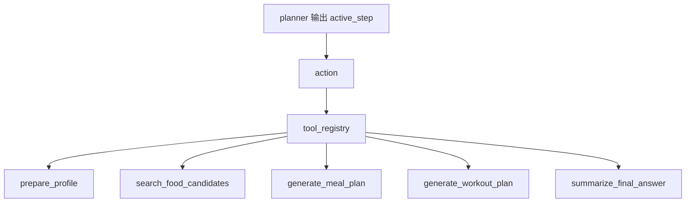
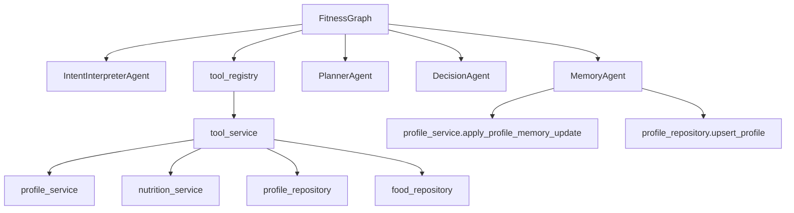

# Fitness Workflow Overview

本文说明当前 [`agent/workflows/fitness.py`](c:/Users/22811/Synology/SynologyDrive/code/fitness-assistant/agent/workflows/fitness.py) 中 `FitnessGraph` 的主流程、各节点职责，以及它与 agents、tools、services、repositories 的协作关系。

## 1. 总览

`fitness` workflow 是一个带规划能力的 agentic loop，当前主流程是：

1. 识别用户本轮意图
2. 如果检测到需要更新长期记忆，优先更新 profile memory
3. 再根据最新 profile 与用户目标规划后续工具调用
4. 执行工具、观察结果、决定继续/重规划/结束
5. 汇总最终回答

当前入口文件：

- `agent/workflows/fitness.py`

核心参与对象：

- `IntentInterpreterAgent`
- `MemoryAgent`
- `PlannerAgent`
- `DecisionAgent`
- `tool_registry`
- `tool_service`

## 2. 主流程图

这对应 `FitnessGraph._build_graph()` 的当前定义：

- `intent_interpreter -> memory_update` when `needs_profile_update = true`
- `intent_interpreter -> planner` when `needs_profile_update = false`
- `memory_update -> planner`
- `planner -> action`
- `action -> observation`
- `observation -> decision`
- `decision -> planner/action/finalize`
- `finalize -> END`

## 3. 节点职责

### 3.1 `intent_interpreter`

位置：

- `agent/workflows/fitness.py::_interpret_intent`
- `agent/agents.py::IntentInterpreterAgent`

作用：

- 读取 `FitnessRequest`
- 调用 LLM 识别用户本轮主要目标
- 判断是否需要更新 profile
- 注意：这里的 `profile update` 只指运行期长期记忆字段，不包括 onboarding 已处理的基础字段

当前规则：

- onboarding 核心字段，例如年龄、体重、身高、性别、活动水平、健身目标、训练频率、训练时长，不在这里更新
- 如果 intent 识别到需要更新 profile，只允许后续 memory 节点处理：
  - `dietary_notes`
  - `equipment_notes`
  - `other_notes`

### 3.2 `memory_update`

位置：

- `agent/workflows/fitness.py::_update_memory`
- `agent/agents.py::MemoryAgent`

作用：

- 在 planner 之前优先处理长期记忆更新
- 只负责三类字段：
  - `dietary_notes`
  - `equipment_notes`
  - `other_notes`
- 将更新应用到 `request.user_profile`
- 持久化到 `profile_repository`

为什么放在 planner 前面：

- 当一轮输入同时包含“更新 profile”与“生成计划/搜索饮食”时，先更新记忆，后续规划和工具执行才能用上最新约束

示例：

- “我乳糖不耐，家里只有哑铃，顺便帮我安排减脂训练”
  - 先写入 `dietary_notes` 和 `equipment_notes`
  - 再进入 planner 选择后续工具

### 3.3 `planner`

位置：

- `agent/workflows/fitness.py::_plan`
- `agent/agents.py::PlannerAgent`

作用：

- 读取当前 intent、已执行步骤、当前 artifacts
- 从可用工具列表中选出最合适的下一步
- 返回 `PlannerOutput`

输出重点：

- `next_step`
- `remaining_steps`
- `reasoning`

### 3.4 `action`

位置：

- `agent/workflows/fitness.py::_act`

作用：

- 根据 `active_step.tool_name` 从 `tool_registry` 找到工具
- 组装 payload
- 执行工具
- 将工具产物写入 `artifacts`
- 记录 `ActionRecord`

### 3.5 `observation`

位置：

- `agent/workflows/fitness.py::_observe`

作用：

- 记录本轮工具执行后的 observation
- 作为下一轮 decision 的输入

### 3.6 `decision`

位置：

- `agent/workflows/fitness.py::_decide`
- `agent/agents.py::DecisionAgent`

作用：

- 结合 `latest_observation`、`artifacts`、`remaining_steps`
- 决定 workflow 接下来：
  - `continue`
  - `replan`
  - `finish`

### 3.7 `finalize`

位置：

- `agent/workflows/fitness.py::_finalize`

作用：

- 如果还没有 `final_answer`，调用 `summarize_final_answer`
- 输出最终面向用户的结果

## 4. MemoryAgent 设计说明

`MemoryAgent` 的职责是“提取并维护结构化长期记忆”，不是做基础 onboarding。

### 4.1 允许更新的字段

- `dietary_notes`
- `equipment_notes`
- `other_notes`

### 4.2 不允许在这里更新的字段

这些字段由 onboarding 负责：

- `age`
- `weight`
- `height`
- `gender`
- `activity_level`
- `fitness_goal`
- `workout_frequency`
- `workout_duration`

### 4.3 MemoryAgent 输出

当前结构化输出模型是 `ProfileMemoryUpdate`，主要包含：

- `should_update_profile`
- `reasoning`
- `dietary_notes`
- `equipment_notes`
- `other_notes_to_add`
- `other_notes_to_remove`
- `acknowledgement`

### 4.4 合并策略

在 `profile_service` 中完成：

- `dietary_notes` / `equipment_notes`
  - 按名称归一化后合并
  - 新值覆盖旧值
- `other_notes`
  - 支持追加与删除
  - 自动去重

## 5. 状态对象

当前 `FitnessState` 中与新流程最相关的字段：

| 字段 | 作用 |
| --- | --- |
| `request` | 用户请求与 profile |
| `intent` | intent agent 输出 |
| `memory_update` | memory agent 输出 |
| `active_step` | 当前计划执行步骤 |
| `remaining_steps` | 后续建议步骤 |
| `artifacts` | 全部中间产物 |
| `latest_observation` | 最近一次工具执行结果 |
| `errors` | 错误集合 |
| `iterations` | 当前循环轮次 |
| `final_answer` | 最终回答 |

## 6. Tool 调用关系

`tool_registry` 定义在：

- `agent/tools.py`

实际业务实现主要在：

- `agent/services/tool_service.py`

## 7. 分层关系

职责总结：

- `workflow`：编排流程与状态
- `agents`：做结构化推理
- `tools`：暴露工具入口
- `tool_service`：组装和执行面向 workflow 的业务动作
- `profile_service` / `nutrition_service`：领域逻辑
- `repositories`：持久化与数据访问

## 8. 当前关于 profile 更新的规则

现在主流程中的 profile 更新有两类：

1. onboarding 阶段的核心字段补全
2. fitness workflow 运行期间的长期记忆维护

二者明确分开：

- onboarding 负责基础资料
- `MemoryAgent` 负责运行期记忆

这样做的好处是：

- intent prompt 更聚焦
- profile update 的责任边界更清晰
- 当用户一轮里同时提出“改偏好 + 做计划”时，可以稳定做到“先更新 profile，再继续任务”
