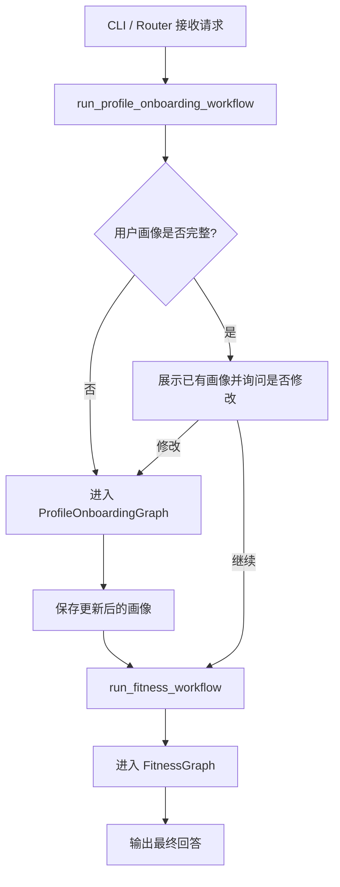
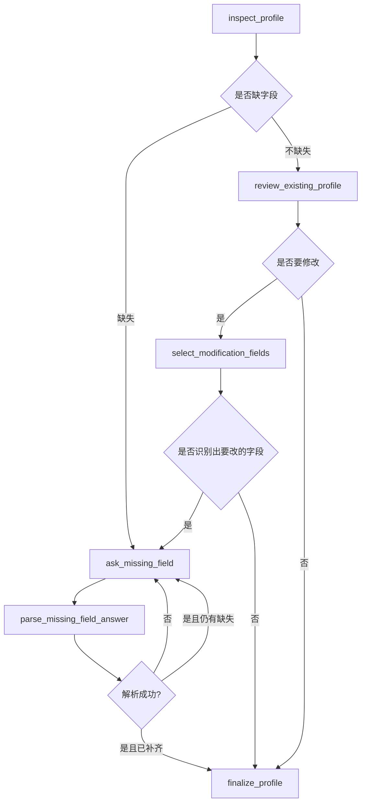
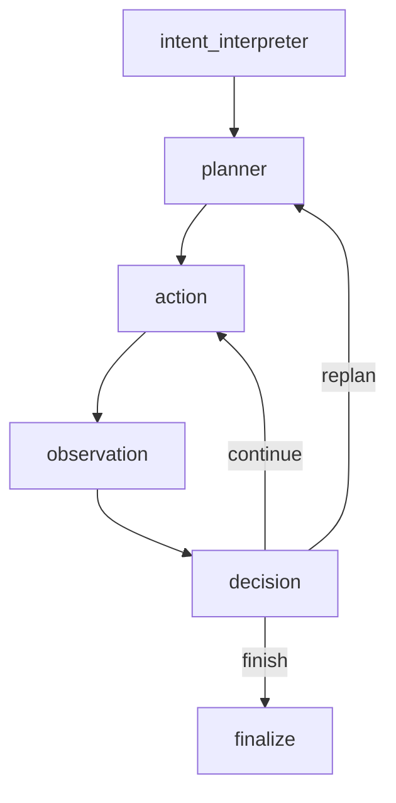
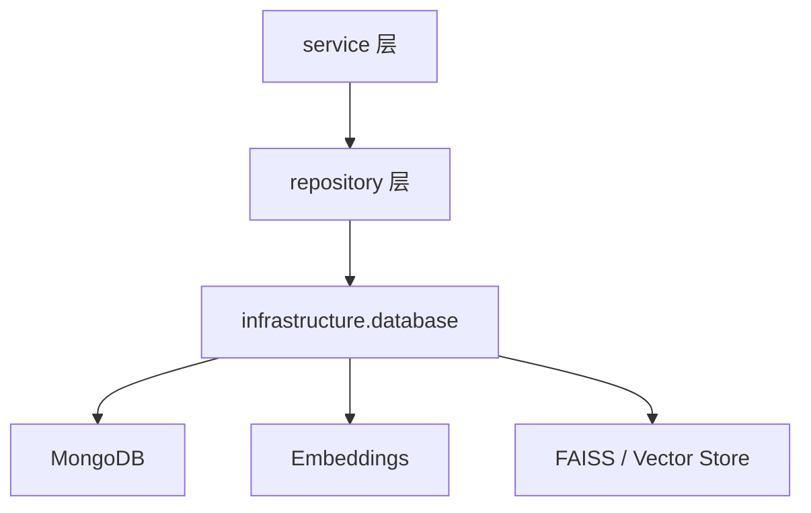

# Fitness Assistant 项目导读

这份文档面向“第一次系统性阅读项目代码”的场景，帮助你快速理解当前项目的核心模块、分层思路、主要调用链和运行流程。

## 1. 项目目标

这个项目当前的核心目标是：

- 通过命令行或 HTTP 接口与用户交互
- 在会话开始时先完成用户画像 onboarding
- 再通过一个基于 graph 的 agent workflow，完成健身相关问答、饮食计划、训练计划等任务
- 在执行过程中保留中间产物 artifacts，并输出结构化事件供调试或前端展示

当前项目整体风格可以概括为：

- `onboarding graph` 负责会话启动阶段
- `main workflow graph` 负责正式 agent 推理与工具调用
- `application / services / repositories / infrastructure` 分层组织代码

---

## 2. 目录结构

当前最重要的目录和文件如下：

```text
agent/
├─ application/
│  └─ use_cases.py
├─ infrastructure/
│  └─ database.py
├─ repositories/
│  ├─ food_repository.py
│  └─ vector_index_repository.py
├─ services/
│  ├─ database_admin_service.py
│  ├─ nutrition_service.py
│  ├─ profile_service.py
│  └─ tool_service.py
├─ agents.py
├─ cli.py
├─ graph.py
├─ llm.py
├─ models.py
├─ prompts.py
├─ router.py
└─ tools.py
```

---

## 3. 分层理解

### 3.1 Interface 层

负责接收用户输入、展示结果，但尽量不承担复杂业务逻辑。

- [agent/cli.py](/c:/Users/22811/Synology/SynologyDrive/code/fitness-assistant/agent/cli.py)
  命令行入口。负责：
  - 启动 CLI
  - 调用 onboarding workflow
  - 调用主聊天 workflow
  - 打印事件流和最终结果

- [agent/router.py](/c:/Users/22811/Synology/SynologyDrive/code/fitness-assistant/agent/router.py)
  FastAPI 路由入口。负责：
  - 暴露 `/generate`
  - 暴露营养搜索、索引、数据库检查等接口

### 3.2 Application 层

负责“组装一个完整用例”。

- [agent/application/use_cases.py](/c:/Users/22811/Synology/SynologyDrive/code/fitness-assistant/agent/application/use_cases.py)
  这里定义了两个核心用例：
  - `run_profile_onboarding_workflow`
  - `run_fitness_workflow`

这一层不做底层实现，而是：

- 选择要跑哪个 graph
- 把 event handler / prompt_user / notify_user 等依赖传进去

### 3.3 Graph 层

负责定义状态机和整体流程编排。

- [agent/graph.py](/c:/Users/22811/Synology/SynologyDrive/code/fitness-assistant/agent/graph.py)

这里有两条 graph：

- `ProfileOnboardingGraph`
  用于会话开始时检查和补全用户画像
- `FitnessGraph`
  用于正式的 agent workflow

这一层是整个项目的“流程中枢”。

### 3.4 Agent 层

负责把 LLM 组织成几个职责清晰的代理。

- [agent/agents.py](/c:/Users/22811/Synology/SynologyDrive/code/fitness-assistant/agent/agents.py)

当前主要有：

- `IntentInterpreterAgent`
  把用户输入转成结构化意图
- `PlannerAgent`
  决定下一步调用哪个工具
- `DecisionAgent`
  判断继续、重规划还是结束
- `ProfileCollectionAgent`
  在 onboarding 时决定下一句问什么，以及如何解析用户回答

### 3.5 Tool 层

负责把业务能力注册成 LangChain `StructuredTool`。

- [agent/tools.py](/c:/Users/22811/Synology/SynologyDrive/code/fitness-assistant/agent/tools.py)

这里主要做两件事：

- 定义每个 tool 的输入 schema
- 把 service 层函数包装成统一工具注册表

也就是说，真正业务实现并不在 `tools.py`，而是在 service 层。

### 3.6 Service 层

负责主要业务逻辑。

- [agent/services/profile_service.py](/c:/Users/22811/Synology/SynologyDrive/code/fitness-assistant/agent/services/profile_service.py)
  负责用户画像相关逻辑：
  - 读取/保存 profile
  - 计算 BMR / TDEE / 宏量目标
  - 判断缺失字段
  - 处理 onboarding 修改逻辑

- [agent/services/tool_service.py](/c:/Users/22811/Synology/SynologyDrive/code/fitness-assistant/agent/services/tool_service.py)
  负责各个工具的真正业务实现：
  - prepare profile
  - 搜索候选食物
  - 生成饮食计划
  - 生成训练计划
  - 生成最终总结

- [agent/services/nutrition_service.py](/c:/Users/22811/Synology/SynologyDrive/code/fitness-assistant/agent/services/nutrition_service.py)
  负责营养检索与索引逻辑：
  - semantic search
  - hybrid search
  - mongo food search
  - 创建向量索引
  - 查询索引状态

- [agent/services/database_admin_service.py](/c:/Users/22811/Synology/SynologyDrive/code/fitness-assistant/agent/services/database_admin_service.py)
  负责数据库运维类功能：
  - 测试 Mongo 连接
  - 查看数据库统计
  - 导入 sample 数据
  - 检查数据库可用性

### 3.7 Repository 层

负责对数据库和索引文件的具体访问。

- [agent/repositories/food_repository.py](/c:/Users/22811/Synology/SynologyDrive/code/fitness-assistant/agent/repositories/food_repository.py)
  面向 food collection 的 Mongo 访问

- [agent/repositories/vector_index_repository.py](/c:/Users/22811/Synology/SynologyDrive/code/fitness-assistant/agent/repositories/vector_index_repository.py)
  面向 FAISS 索引与索引文件访问

### 3.8 Infrastructure 层

负责底层资源初始化与连接复用。

- [agent/infrastructure/database.py](/c:/Users/22811/Synology/SynologyDrive/code/fitness-assistant/agent/infrastructure/database.py)

这里集中管理：

- Mongo client
- embeddings model
- vector store cache
- index path

### 3.9 配置与模型

- [agent/models.py](/c:/Users/22811/Synology/SynologyDrive/code/fitness-assistant/agent/models.py)
  全项目的数据模型中心

- [agent/prompts.py](/c:/Users/22811/Synology/SynologyDrive/code/fitness-assistant/agent/prompts.py)
  所有主要 prompt 的集中定义

- [agent/llm.py](/c:/Users/22811/Synology/SynologyDrive/code/fitness-assistant/agent/llm.py)
  创建统一的 ChatOpenAI 实例

---

## 4. 先读哪几个文件

如果你想最快读懂项目，推荐顺序：

1. [agent/cli.py](/c:/Users/22811/Synology/SynologyDrive/code/fitness-assistant/agent/cli.py)
2. [agent/application/use_cases.py](/c:/Users/22811/Synology/SynologyDrive/code/fitness-assistant/agent/application/use_cases.py)
3. [agent/graph.py](/c:/Users/22811/Synology/SynologyDrive/code/fitness-assistant/agent/graph.py)
4. [agent/agents.py](/c:/Users/22811/Synology/SynologyDrive/code/fitness-assistant/agent/agents.py)
5. [agent/tools.py](/c:/Users/22811/Synology/SynologyDrive/code/fitness-assistant/agent/tools.py)
6. [agent/services/tool_service.py](/c:/Users/22811/Synology/SynologyDrive/code/fitness-assistant/agent/services/tool_service.py)
7. [agent/services/profile_service.py](/c:/Users/22811/Synology/SynologyDrive/code/fitness-assistant/agent/services/profile_service.py)
8. [agent/services/nutrition_service.py](/c:/Users/22811/Synology/SynologyDrive/code/fitness-assistant/agent/services/nutrition_service.py)
9. [agent/models.py](/c:/Users/22811/Synology/SynologyDrive/code/fitness-assistant/agent/models.py)
10. [agent/prompts.py](/c:/Users/22811/Synology/SynologyDrive/code/fitness-assistant/agent/prompts.py)

---

## 5. 核心流程图

### 5.1 启动整体流程



### 5.2 Onboarding Graph



### 5.3 主 Agent Workflow



---

## 6. 主 workflow 详细说明

### 6.1 intent_interpreter

通过 `IntentInterpreterAgent` 把用户输入转成结构化的 `IntentAnalysis`，例如：

- 是否要更新画像
- 是否需要先搜索食物
- 是否需要生成 meal plan
- 是否需要生成 workout plan
- 是否可以直接回答

### 6.2 planner

通过 `PlannerAgent` 基于：

- 用户请求
- 当前 intent
- 已完成步骤
- 当前 artifacts
- 可用工具列表

来决定“下一步最值得执行的工具”。

### 6.3 action

根据 planner 选出的 `tool_name`：

- 构造 tool payload
- 调用对应工具
- 把结果并入 `artifacts`
- 记录执行结果 `executed_steps`

### 6.4 observation

记录当前这一步的 observation，供后面的 `decision` 使用。

### 6.5 decision

通过 `DecisionAgent` 判断：

- 继续执行
- 重新规划
- 结束流程

### 6.6 finalize

如果还没有 `final_answer`，则调用 `summarize_final_answer` 工具，生成最终面向用户的回答。

---

## 7. 什么是 artifacts

`artifacts` 是流程执行过程中积累下来的中间成果。

常见内容包括：

- `user_profile`
- `food_candidates`
- `meal_plan`
- `workout_plan`
- `final_answer`

作用是：

- 避免重复计算
- 给 planner / decision 提供上下文
- 给最终总结工具提供素材

你可以把它理解为 agent workflow 的“工作台”。

---

## 8. 什么是 event

系统在 graph 执行过程中会发出结构化事件，当前统一由 [WorkflowEvent](/c:/Users/22811/Synology/SynologyDrive/code/fitness-assistant/agent/models.py#L305) 表示。

事件的核心字段：

- `event_type`
- `phase`
  - `onboarding`
  - `main_workflow`
- `node`
- `summary`
- `data`

这些事件当前主要用于：

- CLI 中间过程打印
- 后续前端可视化
- 调试和日志记录

---

## 9. Tool 注册表

当前主 workflow 可用工具由 [agent/tools.py](/c:/Users/22811/Synology/SynologyDrive/code/fitness-assistant/agent/tools.py) 注册，主要有：

- `prepare_profile`
- `search_food_candidates`
- `generate_meal_plan`
- `generate_workout_plan`
- `summarize_final_answer`

这些工具的真正业务实现不在 `tools.py`，而在 [agent/services/tool_service.py](/c:/Users/22811/Synology/SynologyDrive/code/fitness-assistant/agent/services/tool_service.py)。

---

## 10. 与数据库和向量索引的关系

项目中的数据访问路径大致是：



具体分工：

- `profile_service`
  读写用户画像
- `nutrition_service`
  调用 `food_repository` 与 `vector_index_repository`
- `database_admin_service`
  做数据库检查和数据导入

---

## 11. 当前项目的两个关键优点

- 分层已经比较清晰
  interface / application / graph / agents / services / repositories / infrastructure 基本都有角色边界

- onboarding 和主 workflow 都 graph 化了
  这让项目整体风格更统一，也更利于后续做可视化和扩展

---

## 12. 当前阅读时最容易混淆的点

### 12.1 agent 和 tool 的区别

- `agent`
  更偏推理和决策
- `tool`
  更偏执行动作

### 12.2 graph 和 use_case 的区别

- `graph`
  定义状态流转
- `use_case`
  负责启动某条 graph

### 12.3 tool 和 service 的区别

- `tools.py`
  是 LangChain 工具注册层
- `tool_service.py`
  才是实际业务逻辑层

---

## 13. 你后续最可能改动的地方

如果你后面要继续扩项目，最常改的通常是：

- [agent/prompts.py](/c:/Users/22811/Synology/SynologyDrive/code/fitness-assistant/agent/prompts.py)
  调 prompt
- [agent/agents.py](/c:/Users/22811/Synology/SynologyDrive/code/fitness-assistant/agent/agents.py)
  调 Agent 行为
- [agent/services/tool_service.py](/c:/Users/22811/Synology/SynologyDrive/code/fitness-assistant/agent/services/tool_service.py)
  调各个工具的业务逻辑
- [agent/services/profile_service.py](/c:/Users/22811/Synology/SynologyDrive/code/fitness-assistant/agent/services/profile_service.py)
  调画像逻辑
- [agent/graph.py](/c:/Users/22811/Synology/SynologyDrive/code/fitness-assistant/agent/graph.py)
  调整体流程

---

## 14. 一句话理解整个项目

这个项目可以理解为：

“先用一个 onboarding graph 补齐用户画像，再用一个 tool-using graph 完成健身任务规划，并通过结构化事件把整个过程显式暴露出来。”
