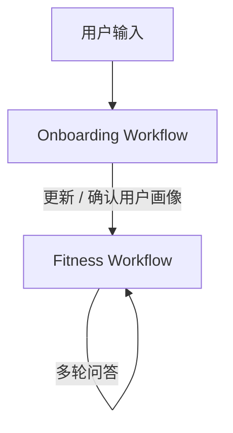
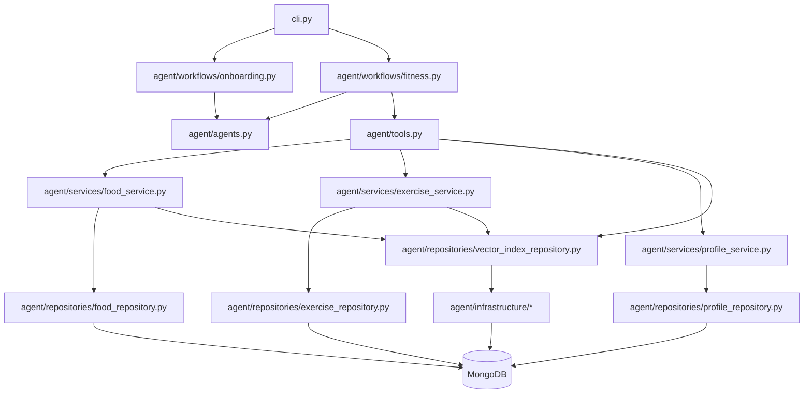
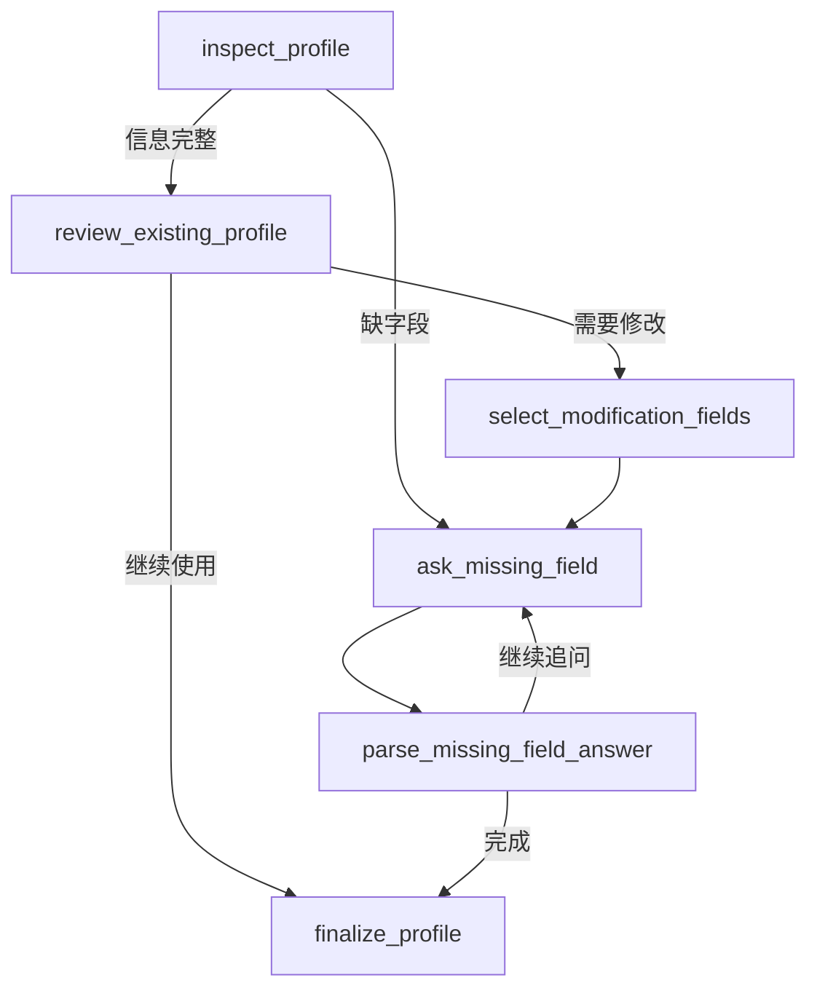
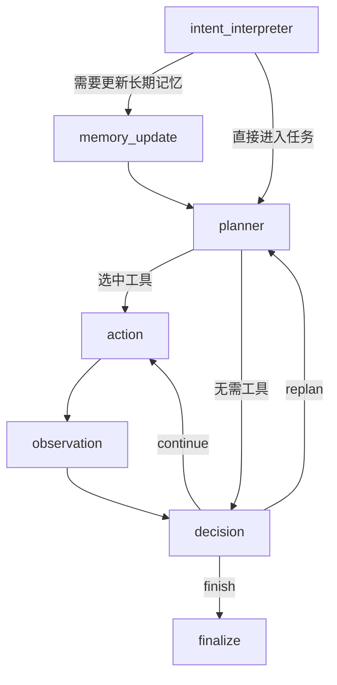
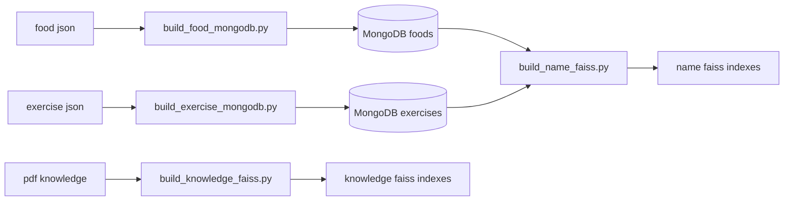

# Fitness Assistant

## 项目概览

这是一个基于langchain / langgraph的健身助手项目，主要用于完成饮食规划、训练规划、实体查询和知识问答

系统整体采用“两层结构”：

- `cli.py` 负责多轮对话、上下文管理、历史 artifacts 管理
- workflow 负责单轮任务执行

其中单轮任务分为两个 workflow：

- `onboarding workflow`：完善用户画像
- `fitness workflow`：处理饮食、训练、知识问答等主任务

---

## 整体流程

---

## 项目结构

分层职责可以概括为：

- `workflows`：流程编排
- `agents`：LLM 节点推理
- `tools`：对 planner 暴露能力
- `services`：领域逻辑
- `repositories`：数据库 / 索引访问
- `infrastructure`：底层运行时和连接

---

## Onboarding Workflow

`onboarding workflow` 用来确认或补齐用户画像。

它关心的核心信息包括：

- 年龄、身高、体重、性别
- 活动水平
- 健身目标
- 每周训练次数
- 单次训练时长

流程如下：

这个 workflow 的目标不是一次性问完所有问题，而是：

- 一次只问一个最重要的问题
- 尽量用自然语言对话补齐资料
- 最终得到一个完整、可计算宏量营养目标的 profile

---

## Fitness Workflow

`fitness workflow` 负责单轮主任务处理，例如：

- 问某种食物 / 动作是什么
- 询问营养或训练知识
- 生成 meal plan
- 生成 workout plan
- 修改已有方案

流程如下：

可以把这条链理解为：

1. 先判断用户这一轮想做什么
2. 如果说了长期偏好，就先写入 profile memory
3. planner 决定下一步工具
4. tool 返回 artifact 和 observation
5. decision 判断是否继续
6. summary 生成最终回答

---

## 数据处理与检索策略

## 数据来源

项目当前使用三类数据：

- 食物数据：FoodData Central foundation foods
- 动作数据：结构化 exercise JSON
- 知识数据：营养与训练相关 PDF 文档

整体数据流如下：

---

## 基本处理

### 食物

食物数据会被整理成适合 meal planning 的轻量结构，保留：

- 名称
- 类别
- 每 100g 宏量营养
- 常见 measurement

### 动作

动作数据基本按原始结构入库，保留：

- 名称
- category
- equipment
- primary muscles
- 说明信息

### 知识库

PDF 文档会被转成 Markdown，再切分为：

- text chunks
- table chunks

之后分别建索引，再在检索时合并和 rerank。

---

## Candidate 标注

项目没有直接把全量数据库都暴露给生成模型，而是先做 candidate 压缩。

### 食物 candidate

思路是：

- 先按相近食材聚类
- 每组选择代表项
- 用这些代表项构成 meal planning 的候选池

### 动作 candidate

思路是：

- 先按 `category + equipment + primary muscle` 分桶
- 再基于LLM从每个桶里选出少量最常见、最基础、最适合规划的动作

这样做的目的都是一样的：

- 减少噪声
- 降低 token 消耗
- 让 LLM 面对一个更稳定的候选池

---

## Candidate 筛选

### Meal plan

meal plan 并不是从所有食物里任意挑选，而是先按 slot 筛选：

- `proteins`
- `carbs`
- `vegetables`
- `fats`
- `oil`
- `flexible`

其中：

- `fats` 主要是坚果 / 种子
- `oil` 单独作为烹饪油来源

这使得 meal plan 更像真实配餐，而不是从全库里随意拼接。

### Workout plan

workout plan 当前只关注：

- `strength`
- `cardio`

再进一步组织成：

- `strength_compounds`
- `strength_accessories`
- `core_pool`
- `cardio_modes`

并结合：

- 可用器械
- 目标肌群
- cardio 偏好

动态收缩候选范围。

---

## 检索策略

项目当前有三类检索：

### 1. 实体检索

用于：

- 查具体食物
- 查具体动作

流程：

1. 用名称向量索引做近似匹配
2. 用 document id 回查 MongoDB 全文档

### 2. 知识检索

用于：

- 通用营养问题
- 通用训练问题
- 需要原理性解释的问题

流程：

1. 从 `text` 知识库召回候选
2. 从 `table` 知识库召回候选
3. 合并候选
4. 用 reranker 排序
5. 返回最终 top-k

### 3. 计划生成

用于：

- meal plan
- workout plan

这类任务不是简单检索，而是：

- 用 candidate 作为主要参考池
- 结合 profile、preferences、prior lookup
- 由 LLM 生成结构化方案

---

## 容错与开销优化

项目当前已经实现了几层比较关键的容错机制。

### 1. 结构化输出重试

所有关键节点都依赖 Pydantic schema。

如果模型输出不符合 schema，会自动重试，并补充更明确的字段说明。

这对 plan 生成尤其重要。

### 2. Workflow 级错误记录

tool 调用失败时：

- 会写入 `errors`
- 会生成失败 observation
- decision 可以据此选择 replan 或 finish

### 3. 多轮消息压缩

`cli.py` 会维护消息窗口。

当历史消息过长时：

- 压缩旧消息为 `conversation_summary`
- 保留最近几轮原始消息

这样既能保留上下文，又不至于无限膨胀。

### 4. Artifact 摘要化

artifact 不只是保存结果本身，也保存一条简短 summary。

planner 和 decision 主要看 artifact summary，而不是完整 artifact。

这样可以：

- 降低 token 开销
- 提高多轮判断稳定性

### 5. 索引与模型缓存

embedding model、reranker、FAISS / LlamaIndex 索引会在运行时缓存。

这样可以避免每轮都重新加载模型与索引。

